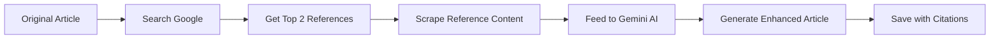

<div align="center">

# 📝 BeyondChats Article Automation

### AI-Powered Blog Scraping & Content Enhancement Platform

[](https://nodejs.org/)
[](https://react.dev/)
[](https://www.mongodb.com/)
[](https://expressjs.com/)

<p align="center">
A full-stack MERN application that automates blog article scraping, enhances content using Google Gemini AI, and displays both original and AI-enhanced articles through a modern React interface.
</p>

---

[Features](#-features) •
[Tech Stack](#-tech-stack) •
[Architecture](#-architecture) •
[Installation](#-installation) •
[API Reference](#-api-reference) •
[Screenshots](#-screenshots)

</div>

---

## 🎯 Project Overview

This project implements an **end-to-end content automation pipeline** that demonstrates:

- **Web Scraping** - Automated extraction of blog articles using Cheerio
- **RESTful APIs** - Complete CRUD operations with Express.js
- **AI Integration** - Content enhancement using Google Gemini AI
- **Search Integration** - Google Search API for reference article discovery
- **Modern Frontend** - Responsive React application with professional UI

> **Note:** While the original assignment mentioned Laravel, this implementation uses the **MERN Stack** while maintaining the same logic, workflow, and outcomes.

---

## ✨ Features

### Phase 1: Article Scraping & CRUD APIs
| Feature | Description |
|---------|-------------|
| 🕷️ Web Scraping | Scrapes the 5 oldest articles from BeyondChats blog |
| 💾 Data Storage | Stores articles in MongoDB with structured schema |
| 🔄 CRUD Operations | Full Create, Read, Update, Delete functionality |
| ☁️ Image CDN | Cloudinary integration for image storage & optimization |

### Phase 2: AI-Powered Content Enhancement
| Feature | Description |
|---------|-------------|
| 🔍 Google Search | Finds top-ranking similar articles using SerpAPI |
| 📄 Reference Scraping | Extracts content from reference articles |
| 🤖 Gemini AI | Rewrites and enhances articles with fresh perspectives |
| 📚 Citations | Adds source references to enhanced articles |

### Phase 3: React Frontend
| Feature | Description |
|---------|-------------|
| 📱 Responsive Design | Mobile-friendly, professional blog UI |
| 🔗 Client-Side Routing | Seamless navigation with React Router |
| ⚡ Fast Performance | Built with Vite for optimal speed |
| 🎨 Modern UI/UX | Clean, intuitive interface |

---

## 🛠️ Tech Stack

### Backend
| Technology | Version | Purpose |
|-----------|---------|---------|
| **Node.js** | 18+ | Runtime environment |
| **Express.js** | 5.2.1 | Web framework |
| **MongoDB** | Atlas | Database |
| **Mongoose** | 9.0.2 | ODM for MongoDB |

### Frontend
| Technology | Version | Purpose |
|-----------|---------|---------|
| **React** | 19.2.0 | UI library |
| **Vite** | 7.2.4 | Build tool |
| **React Router** | 7.11.0 | Client-side routing |
| **Axios** | 1.13.2 | HTTP client |

### External Services
| Service | Purpose |
|---------|---------|
| **Google Gemini AI** | Content generation & enhancement |
| **SerpAPI** | Google Search integration |
| **Cloudinary** | Image storage & CDN |
| **MongoDB Atlas** | Cloud database hosting |

---

## 🏗️ Architecture

```
┌─────────────────────────────────────────────────────────────────┐
│                        FRONTEND (React + Vite)                   │
│  ┌──────────┐  ┌──────────┐  ┌──────────────┐  ┌─────────────┐ │
│  │ BlogList │  │BlogDetail│  │EnhancedList  │  │EnhancedDetail│ │
│  └────┬─────┘  └────┬─────┘  └──────┬───────┘  └──────┬──────┘ │
└───────┼─────────────┼───────────────┼─────────────────┼────────┘
        │             │               │                 │
        └─────────────┴───────┬───────┴─────────────────┘
                              │ HTTP/REST
┌─────────────────────────────┴───────────────────────────────────┐
│                     BACKEND (Express.js)                         │
│  ┌─────────────────────────────────────────────────────────┐    │
│  │                      API Routes                          │    │
│  │  /api/articles  │  /api/enhance/:id  │  /api/enhanced   │    │
│  └────────┬────────────────┬────────────────────┬──────────┘    │
│           │                │                    │                │
│  ┌────────▼────────┐  ┌────▼────────┐  ┌───────▼────────┐      │
│  │   Controllers   │  │  Services   │  │    Models      │      │
│  └─────────────────┘  └──────┬──────┘  └───────┬────────┘      │
└──────────────────────────────┼─────────────────┼────────────────┘
                               │                 │
        ┌──────────────────────┼─────────────────┘
        │                      │
┌───────▼───────┐  ┌───────────▼───────────┐  ┌─────────────────┐
│   MongoDB     │  │    External APIs      │  │   Cloudinary    │
│   Atlas       │  │  • SerpAPI (Search)   │  │   (Images)      │
│               │  │  • Gemini AI          │  │                 │
└───────────────┘  └───────────────────────┘  └─────────────────┘
```

---

## 📂 Project Structure

```
Assignment/
├── 📁 backend/
│   ├── 📄 app.js                    # Express app configuration
│   ├── 📄 server.js                 # Server entry point
│   ├── 📁 config/
│   │   ├── 📄 db.js                 # MongoDB connection
│   │   ├── 📄 cloudinary.js         # Cloudinary setup
│   │   └── 📄 gemini.js             # Google Gemini AI config
│   ├── 📁 controllers/
│   │   ├── 📄 articleController.js  # CRUD operations
│   │   ├── 📄 enhanceController.js  # AI enhancement logic
│   │   └── 📄 enhancedArticleController.js
│   ├── 📁 models/
│   │   ├── 📄 Article.js            # Original article schema
│   │   └── 📄 EnhancedArticle.js    # Enhanced article schema
│   ├── 📁 routes/
│   │   ├── 📄 articleRoutes.js      # Article CRUD routes
│   │   ├── 📄 enhanceRoutes.js      # Enhancement route
│   │   └── 📄 enhancedArticleRoutes.js
│   ├── 📁 services/
│   │   ├── 📄 enhanceService.js     # Gemini AI integration
│   │   ├── 📄 googleSearch.js       # SerpAPI integration
│   │   └── 📄 scraper.js            # Cheerio web scraping
│   ├── 📁 seed/
│   │   └── 📄 seedArticles.js       # Initial data seeding
│   └── 📁 utils/
│       └── 📄 cleanGeminiJson.js    # JSON parsing utility
│
├── 📁 client/
│   ├── 📄 index.html
│   ├── 📄 vite.config.js
│   └── 📁 src/
│       ├── 📄 App.jsx               # Main app with routing
│       ├── 📄 main.jsx              # Entry point
│       ├── 📁 components/
│       │   └── 📄 Navbar.jsx        # Navigation component
│       └── 📁 pages/
│           ├── 📄 BlogList.jsx      # Original articles list
│           ├── 📄 BlogDetails.jsx   # Original article view
│           ├── 📄 EnhancedBlogList.jsx
│           └── 📄 EnhancedBlogDetails.jsx
│
└── 📄 README.md
```

---

## 🚀 Installation

### Prerequisites

- Node.js 18 or higher
- MongoDB Atlas account
- API keys for: Google Gemini AI, SerpAPI, Cloudinary

### 1️⃣ Clone the Repository

```bash
git clone https://github.com/Akash-ojha-AJ2/Assignment.git
cd Assignment
```

### 2️⃣ Backend Setup

```bash
cd backend
npm install
```

Create a `.env` file in the backend directory:

```env
# Database
DB_URL=mongodb+srv://<username>:<password>@cluster.mongodb.net/

# Google Gemini AI
GEMINI_API_KEY=your_gemini_api_key

# SerpAPI (Google Search)
SERP_API_KEY=your_serpapi_key

# Cloudinary
CLOUDINARY_CLOUD_NAME=your_cloud_name
CLOUDINARY_API_KEY=your_api_key
CLOUDINARY_API_SECRET=your_api_secret
```

#### Seed Initial Articles (First Run Only)

1. Open `app.js`
2. Uncomment line 22: `// await seedArticles();`
3. Start the server: `npm start`
4. After seeding completes, comment the line again
5. Restart the server

```bash
npm start
# Server runs on http://localhost:5000
```

### 3️⃣ Frontend Setup

```bash
cd client
npm install
```

Create a `.env` file in the client directory:

```env
VITE_SERVER=http://localhost:5000
```

Start the development server:

```bash
npm run dev
# Frontend runs on http://localhost:5173
```

---

## 📡 API Reference

### Articles API

| Method | Endpoint | Description |
|--------|----------|-------------|
| `GET` | `/api/articles` | Fetch all original articles |
| `GET` | `/api/articles/:id` | Fetch single article |
| `POST` | `/api/articles` | Create new article (with image) |
| `PUT` | `/api/articles/:id` | Update article |
| `DELETE` | `/api/articles/:id` | Delete article |

### Enhancement API

| Method | Endpoint | Description |
|--------|----------|-------------|
| `PUT` | `/api/enhance/:id` | Enhance article using AI |

### Enhanced Articles API

| Method | Endpoint | Description |
|--------|----------|-------------|
| `GET` | `/api/enhanced-articles` | Fetch all enhanced articles |
| `GET` | `/api/enhanced-articles/:id` | Fetch single enhanced article |

---

## 📸 Screenshots

<details>
<summary>Click to view screenshots</summary>

### Original Articles Page
The homepage displays all scraped articles with cover images, tags, and an "Enhance" button.

### Enhanced Articles Page
Shows AI-enhanced articles with improved content and source citations.

### Article Detail View
Full article view with structured sections and professional formatting.

</details>

---

## 🔧 How It Works

### AI Enhancement Pipeline



1. **Fetch Original**: Gets the article from MongoDB
2. **Google Search**: Uses SerpAPI to find similar high-ranking articles
3. **Scrape References**: Extracts content from top 2 results using Cheerio
4. **AI Enhancement**: Gemini AI rewrites the article with new insights
5. **Save & Cite**: Stores enhanced version with source references

---

## 🎓 Key Learning Outcomes

This project demonstrates proficiency in:

- ✅ **Full-Stack Development** - Complete MERN stack implementation
- ✅ **API Design** - RESTful API architecture with proper routing
- ✅ **Database Modeling** - MongoDB schema design with Mongoose
- ✅ **Web Scraping** - Automated content extraction with Cheerio
- ✅ **AI Integration** - Google Gemini API for content generation
- ✅ **Third-Party APIs** - SerpAPI, Cloudinary integration
- ✅ **Modern React** - Hooks, routing, component architecture
- ✅ **Clean Code** - Separation of concerns, modular structure

---

## 🔮 Future Improvements

- [ ] Add user authentication and authorization
- [ ] Implement article scheduling and auto-enhancement
- [ ] Add pagination for large article lists
- [ ] Implement caching for improved performance
- [ ] Add comprehensive test coverage
- [ ] Deploy to cloud platform (Vercel/Render)

---

## 👨‍💻 Author

<div align="center">

**Akash Ojha**

[](https://github.com/Akash-ojha-AJ2)

</div>

---

<div align="center">

Made with ❤️ for the BeyondChats Internship Assignment

</div>


